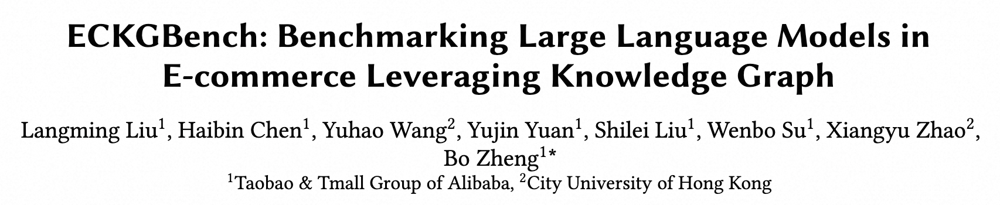
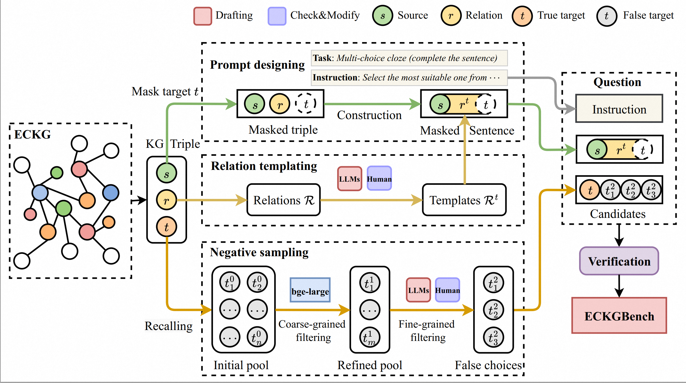

# [CIKM'25] ECKGBench
Title: ECKGBench: Benchmarking Large Language Models in E-commerce Leveraging Knowledge Graph [**CIKM 2025 Accepted Paper**]



The paper link: [ECKGBench: Benchmarking Large Language Models in E-commerce Leveraging Knowledge Graph](https://arxiv.org/abs/2503.15990).

## Overview


## Description

### Source data: ECKG (e-commerce knowledge graph) `./source/ecom_KG.jsonl.zip`

The large-scale e-commerce knowledge graph is extracted from Taobao, containing sufficient e-commerce knowledge and concepts. 
We introduce the development of ECKG. 

First, we define the types of entities in Taobao, such as item category, function, style, design, color, and user group (e.g., children, adults, elderly). Then, we design the relation types according to the potential links between the entities. Based on the predefined entities and relations, the system automatically generates candidate triples, each formed as $\langle s, r, t \rangle$, representing the **source entity**, **relation**, and **target entity**.

The annotators manually annotate the candidate triple with *true* or *false* to indicate whether this is true. 
Statistically, ECKG consists of $4.8$ M candidate KG triples, where $2.1$ M are true triples. 
For example, a true triple is like $\langle$*Leather Jacket, Need, Heat Insulation*$\rangle$ or $\langle$*cloud white, similar, milk white*$\rangle$, while the false one is like $\langle$*leather jacket, need, heat dissipation*$\rangle$ or $\langle$*cloud white, similar, yellow*$\rangle$.

Apart from the triple itself, each entity has additional descriptions (e.g., category), improving clarity.
There are $15$ parent relations and $93$ child relations that depict the link between entities.

### Evaluation data:  [ECKGBench](Datasets/ECKGBench.jsonl)

ECKGBench is a Chinese factuality benchmark dataset to evaluate LLMs' capability in the e-commerce domain. Each question is constructed from a KG triple from ECKG. We propose two refinements over the basic cloze task on triples:

- **We convert the triple into a sentence**, where $s, r, t$ correspond to subject, predicate, and object. Remarkably, we design templates for $r$ to make them appropriate predicates. We also filter out the triples with entities $s, t$ unsuitable to be subject or object by rules (e.g., sensitive words). We only consider masking $t$, making it close to the standard generation task.
- **We apply the multi-choice paradigm**. We obtain candidates by merging the ground truth $t$ and the false choices $\{t^2_1,t^2_2,t^2_3\}$ generated by negative sampling.

This way, we design the multi-choice cloze task, asking to complete a sentence about e-commerce knowledge, given choices. 

We also provide a quickly generated larger dataset without negative sampling, named [ECKGBench_large](Datasets/ECKGBench_large.jsonl).

### Question generation: [generation_pipeline](./generation_pipeline.ipynb)
We provide the necesarry demo for each stage of our proposed question generation pipeline.
The pipeline mainly consists of two parts: 
- **Basic generation:** use template for quick generation of question prompts from KG.
- **Negative sampling:** conduct the negative sampling for carefully select candidate choice, thereby improve question quality.
--· dfasfdsa 

### Inference and Evaluation: [eval](./eval.ipynb)
We provide the demo for inference and evaluation based on ECKGBench.

## Download Data & LLM
* Download LLMs to be evaluated (e.g., `Qwen/Qwen3-4B`) from [Huggingface](https://huggingface.co/Qwen/Qwen3-4B).

## Requirements
* pytorch 2.4
* transformers

## Citation
Please cite our paper if you use our dataset.
```
@article{liu2025eckgbench,
  title={ECKGBench: Benchmarking Large Language Models in E-commerce Leveraging Knowledge Graph},
  author={Liu, Langming and Chen, Haibin and Wang, Yuhao and Yuan, Yujin and Liu, Shilei and Su, Wenbo and Zhao, Xiangyu and Zheng, Bo},
  journal={arXiv preprint arXiv:2503.15990},
  year={2025}
}
```